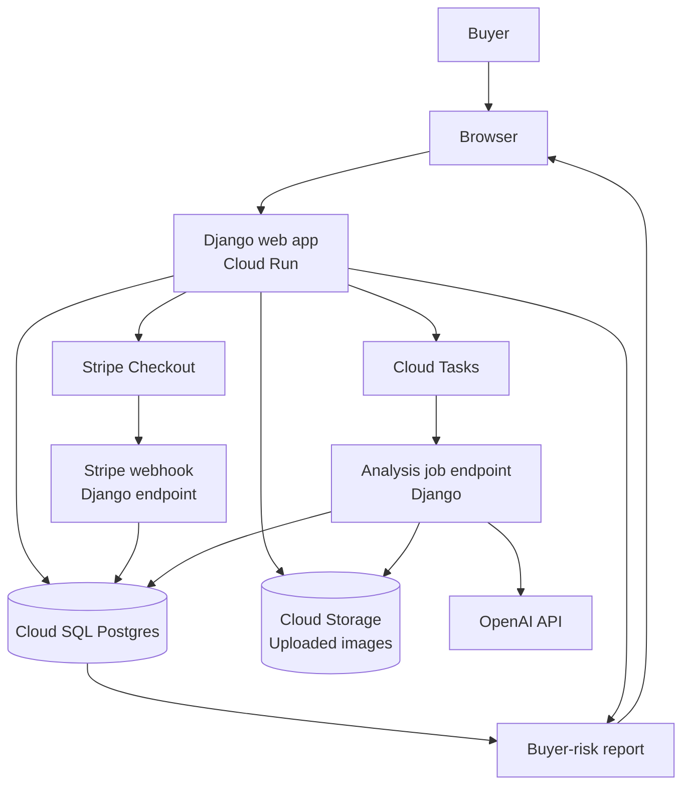

# WatchRisk

Pre-purchase risk reports for luxury watch buyers.

WatchRisk is a mobile-first web app that helps buyers evaluate luxury watch listings before purchase. Users upload listing photos, seller claims, pricing details, and reference information. The app generates a buyer-risk report that flags missing evidence, visible inconsistencies, seller-risk signals, and recommended next questions.

WatchRisk does not authenticate watches. It does not certify watches. It provides a photo-based buyer-risk assessment.

## Current product scope

The first version focuses on one workflow:

> A buyer is considering a watch listing and wants to know whether the deal is worth pursuing before sending money.

The report should help the buyer answer:

- Are the uploaded photos good enough to make a basic risk decision?
- What required evidence is missing?
- Are there visible inconsistencies?
- Does the claimed reference appear consistent with the visible details?
- Is the price suspicious, fair, or high relative to the claim?
- What should the buyer ask the seller next?
- Should the buyer proceed, negotiate, request inspection, or walk away?

## Non-goals

The first version will not:

- authenticate watches
- issue certificates
- guarantee authenticity
- act as a marketplace
- replace a watchmaker or brand service center
- support every brand and reference
- train a custom computer vision model
- provide counterfeit improvement guidance

## Core architecture



## Tech stack

| Area | Choice |
|---|---|
| Language | Python |
| Web framework | Django |
| Frontend | Django templates + HTMX |
| Styling | Bootstrap first, Tailwind later if needed |
| Database | Postgres |
| Database hosting | Cloud SQL |
| File storage | Google Cloud Storage in production, local media in development |
| Runtime | Cloud Run |
| Async jobs | Cloud Tasks in production, management command locally |
| Payments | Stripe Checkout |
| AI provider | OpenAI API |
| Secrets | Google Secret Manager |

## Django apps

Initial app layout:

```text
apps/
  accounts/
  cases/
  uploads/
  analysis/
  reports/
  billing/
  admin_tools/
```

### `accounts`

User registration, login, profile, and account-level settings.

### `cases`

Stores the watch listing under review.

### `uploads`

Stores uploaded image metadata and classification results.

### `analysis`

Handles AI calls, structured schemas, prompt versions, deterministic rules, and report generation.

### `reports`

Stores generated buyer-risk reports.

### `billing`

Stripe Checkout sessions, webhook handling, paid state, refunds, and entitlement checks.

### `admin_tools`

Internal screens for reviewing cases, rerunning analysis, correcting reports, and building evaluation data.

## Report language rules

The product must avoid unsupported authentication claims.

Allowed language:

- “No obvious photo-based red flags detected.”
- “The submitted images are insufficient for a low-risk buying decision.”
- “The visible details appear broadly consistent with the claimed reference.”
- “Movement authenticity cannot be assessed from the submitted photos.”
- “Request additional photos before proceeding.”
- “Use escrow or an independent watchmaker inspection.”

Avoid:

- “Authentic”
- “Genuine”
- “Fake”
- “Counterfeit”
- “Passed”
- “Certified”
- “Verified Rolex”
- “Guaranteed”

## Local development

See [`docs/development.md`](docs/development.md).

Fast path:

```bash
cp .env.example .env
docker compose up -d db
uv sync
uv run python manage.py migrate
uv run python manage.py createsuperuser
uv run python manage.py runserver
```

Open:

```text
http://localhost:8000
```

Admin:

```text
http://localhost:8000/admin/
```

## Documentation structure

Documentation follows the Divio/Diátaxis style:

```text
docs/
  tutorials/
    first-local-run.md
  how-to/
    add-a-new-watch-reference.md
    run-analysis-job.md
    configure-stripe-webhooks.md
  reference/
    environment-variables.md
    data-model.md
    report-schema.md
  explanation/
    architecture.md
    product-boundaries.md
    risk-scoring.md
```

## License

Proprietary. All rights reserved.

See [`LICENSE`](LICENSE).
