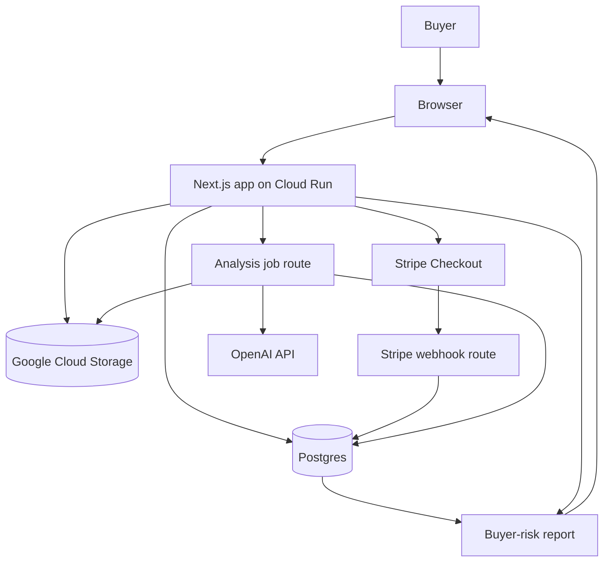

# TypeScript architecture

## Goal

Rewrite the initial Django scaffold as a TypeScript-first web app.

The app should remain a monolith until the paid report workflow is proven.

## Stack

| Area | Choice |
|---|---|
| App framework | Next.js App Router |
| Language | TypeScript |
| Styling | Tailwind |
| UI components | shadcn/ui |
| Database | Postgres |
| ORM | Prisma |
| Validation | Zod |
| File storage | Google Cloud Storage |
| Payments | Stripe Checkout |
| AI | OpenAI API |
| Runtime | Cloud Run |
| Async | Cloud Tasks or a simple worker route first |

## High-level architecture



## Core modules

### `lib/db`

Owns Prisma client and database access helpers.

### `lib/validation`

Owns Zod schemas for forms, API input, and AI output validation.

### `lib/storage`

Owns Google Cloud Storage helpers.

Responsibilities:

- create signed upload URLs
- store image metadata
- generate temporary read URLs for analysis
- prevent public image exposure by default

### `lib/stripe`

Owns Stripe Checkout and webhook verification.

Webhook handling must be idempotent.

### `lib/openai`

Owns OpenAI calls.

Rules:

- use structured JSON output
- validate output with Zod
- store model name and prompt version
- do not let model output become final report without rules applied

### `lib/reports`

Owns deterministic rule application and final report assembly.

This module should:

- cap confidence when evidence is missing
- avoid authentication language
- separate visible evidence from inference
- generate seller questions
- determine recommended next step

## Initial data model

Core entities:

- User
- WatchCase
- CaseImage
- AnalysisRun
- Report
- PaymentRecord

## Suggested Prisma model shape

```prisma
model WatchCase {
  id             String   @id @default(cuid())
  userId         String?
  brand          String
  model          String?
  reference      String?
  claimedYear    String?
  askingPrice    Decimal?
  sellerPlatform String?
  listingUrl     String?
  listingText    String?
  sellerClaims   String?
  status         CaseStatus @default(DRAFT)
  images         CaseImage[]
  reports        Report[]
  payments       PaymentRecord[]
  createdAt      DateTime @default(now())
  updatedAt      DateTime @updatedAt
}

model CaseImage {
  id           String   @id @default(cuid())
  caseId       String
  case         WatchCase @relation(fields: [caseId], references: [id])
  storagePath  String
  claimedType  PhotoType?
  detectedType String?
  qualityScore Float?
  usable       Boolean @default(true)
  analysisJson Json?
  createdAt    DateTime @default(now())
}

model Report {
  id             String   @id @default(cuid())
  caseId         String
  case           WatchCase @relation(fields: [caseId], references: [id])
  riskLevel      RiskLevel
  confidence     ConfidenceLevel
  reportJson     Json
  reportText     String
  rawModelOutput Json?
  modelUsed      String
  promptVersion  String
  createdAt      DateTime @default(now())
  updatedAt      DateTime @updatedAt
}
```

## Avoid premature complexity

Do not add separate services yet.

Do not add:

- event bus
- GraphQL
- native app
- Kubernetes
- browser extension
- human review marketplace
- complex admin platform

Add those only after paid users exist.
