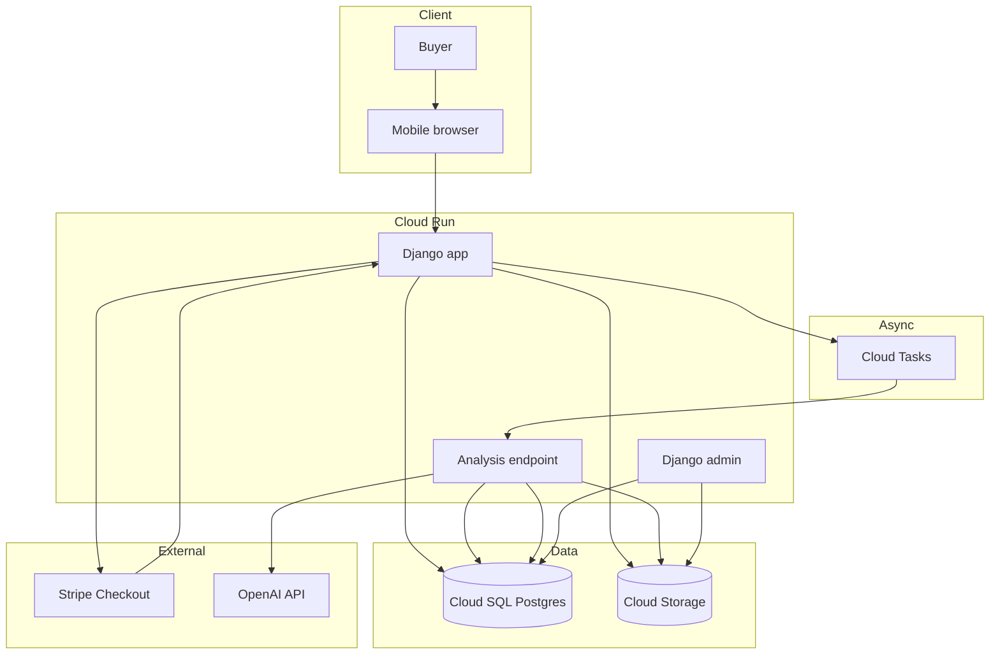

# Architecture

This document explains the basic architecture for WatchRisk.

## System context

WatchRisk is a paid web app for pre-purchase luxury watch listing review.

Users upload listing details and photos. The system stores the case, accepts payment, runs an asynchronous analysis job, and renders a buyer-risk report.

The system does not authenticate watches. It produces structured buyer-risk reports based on submitted evidence.

## Basic architecture diagram



## Main components

### Django web app

The Django app is the main application.

It handles:

- user sessions
- case creation
- upload forms
- report pages
- Stripe checkout creation
- Stripe webhook processing
- internal admin tooling
- task endpoints

The first version should remain a monolith. Splitting services now would add operational work without proving product demand.

### Postgres

Postgres stores core application state.

Primary entities:

- users
- watch cases
- case images
- analysis runs
- reports
- payment records
- prompt versions
- reference records

Postgres is the source of truth for report status.

### Cloud Storage

Cloud Storage stores uploaded watch photos.

The database stores metadata and object references, not raw image bytes.

Image access should be private by default. The app should generate signed URLs only when needed.

### Cloud Tasks

Cloud Tasks triggers asynchronous analysis work.

Payment-confirmed cases should be submitted to a task queue. The task calls a Django endpoint that runs the analysis.

This avoids doing long-running AI analysis in the user request path.

### Stripe

Stripe Checkout handles payment.

Expected flow:

1. User creates a case.
2. User uploads photos.
3. User starts checkout.
4. Stripe redirects after payment.
5. Stripe webhook confirms payment.
6. Django marks the case as paid.
7. Django enqueues the analysis task.

The webhook, not the redirect, should be treated as the source of truth.

### OpenAI API

OpenAI is used for image and report analysis.

The app should not let the model write arbitrary final reports directly. Model output should be structured, validated, and combined with deterministic rules.

The analysis layer should return JSON shaped like the internal report schema.

## Analysis design

The analysis pipeline should be staged.

### Stage 1: Image classification

For each uploaded image:

- detect photo type
- estimate usability
- flag blur, angle, cropping, glare, and obstruction
- extract visible watch-area findings

### Stage 2: Case-level analysis

Using case metadata and image classifications:

- compare claimed brand/model/reference to visible evidence
- identify missing required photos
- flag inconsistent or unsupported claims
- generate seller questions
- produce risk-level recommendation

### Stage 3: Rule application

Apply deterministic caps and overrides.

Examples:

- If no dial photo exists, confidence cannot be high.
- If no movement photo exists, movement cannot be assessed.
- If no clasp photo exists, bracelet assessment is limited.
- If price is materially below expected market range, listing risk increases.
- If seller refuses extra photos, seller risk increases.
- If photo quality is poor, overall confidence decreases.

### Stage 4: Report rendering

The final report should separate:

- visible evidence
- missing evidence
- uncertainty
- next steps

The report must not state that a watch is authentic.

## Deployment shape

Initial deployment:

```text
Cloud Run service:
  django-web

Cloud SQL:
  watchrisk-postgres

Cloud Storage bucket:
  watchrisk-uploads

Cloud Tasks queue:
  watchrisk-analysis

Secret Manager:
  DATABASE_URL
  DJANGO_SECRET_KEY
  OPENAI_API_KEY
  STRIPE_SECRET_KEY
  STRIPE_WEBHOOK_SECRET
```
