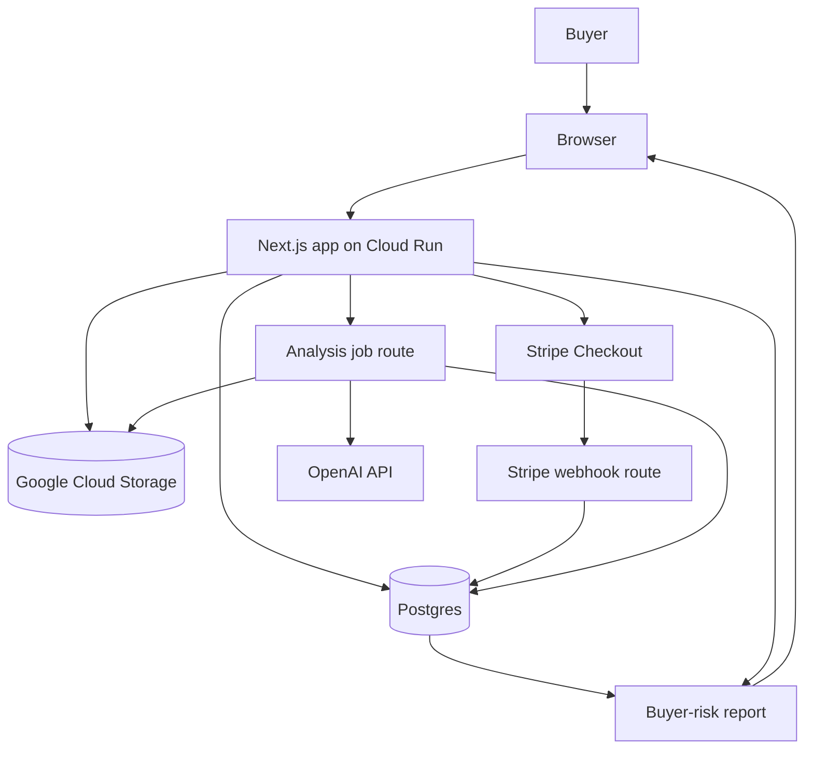

# TypeScript architecture

This document describes **how** the TypeScript app is designed. Intended
product capabilities and implementation status live in
[`docs/reference/features.md`](features.md). Placeholder modules
(Stripe, OpenAI, GCS) in this file are not evidence those integrations exist.

## Goal

Rewrite the initial Django scaffold as a TypeScript-first web app.

The app should remain a monolith until the paid report workflow is proven.

## Stack

| Area | Choice |
|---|---|
| App framework | Next.js App Router |
| Language | TypeScript |
| Styling | Tailwind |
| UI components | shadcn/ui |
| Database | Postgres |
| ORM | Prisma |
| Validation | Zod |
| File storage | Google Cloud Storage |
| Payments | Stripe Checkout |
| AI | OpenAI API |
| Runtime | Cloud Run |
| Async | Cloud Tasks or a simple worker route first |

## High-level architecture



## Core modules

### `lib/db`

Owns Prisma client and database access helpers.

### `lib/validation`

Owns Zod schemas for forms, API input, and AI output validation.

### `lib/storage`

Owns file storage through a `StorageProvider` adapter (`lib/storage/index.ts`).

- **Default:** local disk under `.data/uploads/` (`lib/storage/local.ts`).
- **Later:** GCS when `GCS_BUCKET` is set (client stub throws
  `StorageNotConfiguredError` until wired).

### `lib/payments`

Owns checkout through a `PaymentProvider` adapter (`lib/payments/index.ts`).

- **Default:** `PAYMENTS_MODE=mock` writes `PaymentRecord` rows and grants
  credits or subscriptions via `lib/billing/credits.ts`.
- **Later:** Stripe Checkout when `STRIPE_SECRET_KEY` is present.

Webhook handling must be idempotent when Stripe is enabled.

### `lib/analysis`

Owns report generation through an `AnalysisProvider` adapter
(`lib/analysis/index.ts`).

- **Default:** existing deterministic rules in `lib/reports/generate-report.ts`
  (`modelUsed: deterministic-rules`).
- **Later:** OpenAI vision when `OPENAI_API_KEY` is set (adapter returns not
  configured until wired).

### `lib/email`

Sends Auth.js magic links. Default implementation logs the URL to the server
console in development (`lib/email/console.ts`).

### `lib/auth` and `lib/billing`

- Auth.js (Email magic link) with Prisma adapter tables (`Account`, `Session`,
  `VerificationToken`).
- Credits (`ReportCredit`), subscriptions (`Subscription`), and SKU helpers in
  `lib/billing/`.
- Access helpers in `lib/billing/access.ts` gate explorers and report generation.

### Legacy module names

Older docs refer to `lib/stripe` and `lib/openai`. Commercial MVP code uses the
provider adapters above instead of separate top-level modules.

### `lib/reports`

Owns deterministic rule application and final report assembly.

This module should:

- cap confidence when evidence is missing
- avoid authentication language
- separate visible evidence from inference
- generate seller questions
- determine recommended next step

## Initial data model

Core entities:

- User
- WatchCase
- CaseImage
- AnalysisRun
- Report
- PaymentRecord
- Community
- Seller
- SellerAlias
- SellerCommunity
- Evidence
- Source
- Claim
- RiskFlag
- TrustDimension

## Suggested Prisma model shape

```prisma
model WatchCase {
  id             String   @id @default(cuid())
  userId         String?
  brand          String
  model          String?
  reference      String?
  claimedYear    String?
  askingPrice    Decimal?
  sellerPlatform String?
  listingUrl     String?
  listingText    String?
  sellerClaims   String?
  status         CaseStatus @default(DRAFT)
  images         CaseImage[]
  reports        Report[]
  payments       PaymentRecord[]
  createdAt      DateTime @default(now())
  updatedAt      DateTime @updatedAt
}

model CaseImage {
  id           String   @id @default(cuid())
  caseId       String
  case         WatchCase @relation(fields: [caseId], references: [id])
  storagePath  String
  claimedType  PhotoType?
  detectedType String?
  qualityScore Float?
  usable       Boolean @default(true)
  analysisJson Json?
  createdAt    DateTime @default(now())
}

model Report {
  id             String   @id @default(cuid())
  caseId         String
  case           WatchCase @relation(fields: [caseId], references: [id])
  riskLevel      RiskLevel
  confidence     ConfidenceLevel
  reportJson     Json
  reportText     String
  rawModelOutput Json?
  modelUsed      String
  promptVersion  String
  createdAt      DateTime @default(now())
  updatedAt      DateTime @updatedAt
}
```

## Avoid premature complexity

Do not add separate services yet.

Do not add:

- event bus
- GraphQL
- native app
- Kubernetes
- browser extension
- human review marketplace
- complex admin platform

Add those only after paid users exist.

## Later-phase AI knowledge architecture

The long-term AI direction is a persistent, structured intelligence layer:
structured claims, evidence, and source provenance; time-aware seller/factory
intelligence; and materialized dossiers/snapshots that the runtime consumes
instead of raw retrieval on every call. This extends the data model above rather
than replacing it, and is later-phase work — not immediate MVP scope. See
`docs/explanation/knowledge-architecture.md`.

### Curated model dossiers (MVP)

JSON under `data/knowledge/references/` is validated by
`modelDossierSeedSchema`. `knownVariance` and `highValueChecks` (plus
`factoryVersion` when known) thicken the QC profile. `generateReport` uses
`highValueChecks` for seller questions. Read-only UI lives at `/references` and
`/references/[id]`. Follow `docs/how-to/add-a-new-watch-reference.md`.
